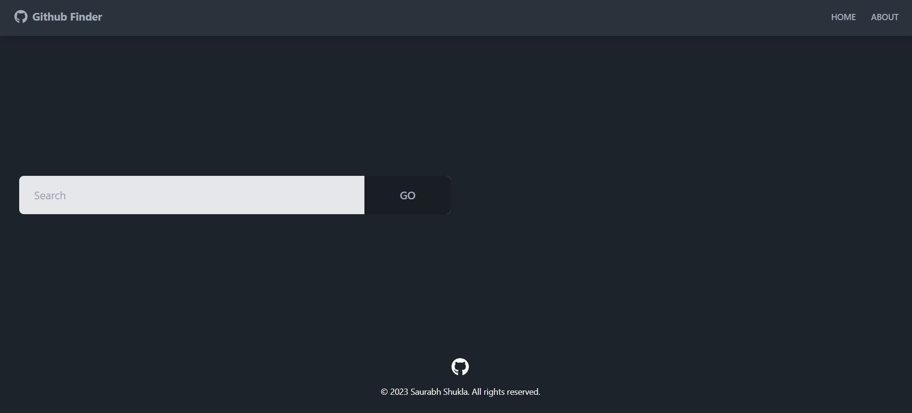

# GitHub Finder

## About

GitHub Finder is a React application that allows you to search for GitHub profiles and view detailed user information. This project is a personal initiative to explore and showcase the capabilities of modern web development technologies.

- Version: 1.0.0

## Features

- Search for GitHub profiles by username.
- View detailed user information, including bio, location, and social links.
- Browse user repositories and their details.
- Built with React.js, Tailwind CSS, Daisy UI, and React Icons.

## Technologies Used

- React.js
- Tailwind CSS
- Daisy UI
- React Icons (Font Awesome icons)
- Context Providers and API
- Reducers (useReducers)
- Axios for API requests
- React Router DOM for routing
- Vite.js for fast and efficient development.

## Installation

1. Clone the repository.
2. Install dependencies using `npm install`.
3. Start the development server using `npm run dev`.

## What I've Learned

During the development of this project, I've gained valuable experience in the following areas:

- Building responsive user interfaces with React.js.
- Styling web applications efficiently using Tailwind CSS and Daisy UI.
- Implementing seamless navigation and user experiences with React Router.
- State management using Context Providers and useReducers for improved data flow.
- Making asynchronous API requests with Axios, ensuring smooth data retrieval.
- Streamlining development with Vite.js, a fast and efficient build tool.

## Screenshots

## Feedback and Contributions

Feedback and contributions are highly appreciated! If you'd like to provide feedback or contribute to this project, please feel free to reach out to me.

## Author

- GitHub: [Saurabh13042004](https://github.com/Saurabh13042004)
- LinkedIn: [Saurabh Shukla](https://www.linkedin.com/in/saurabh-shukla-0b45b3224/)
- Email: [saurabh1258.be21@chitkarauniversity.edu.in](mailto:saurabh1258.be21@chitkarauniversity.edu.in)

## License

This project is open-source and available under the [MIT License](LICENSE).
